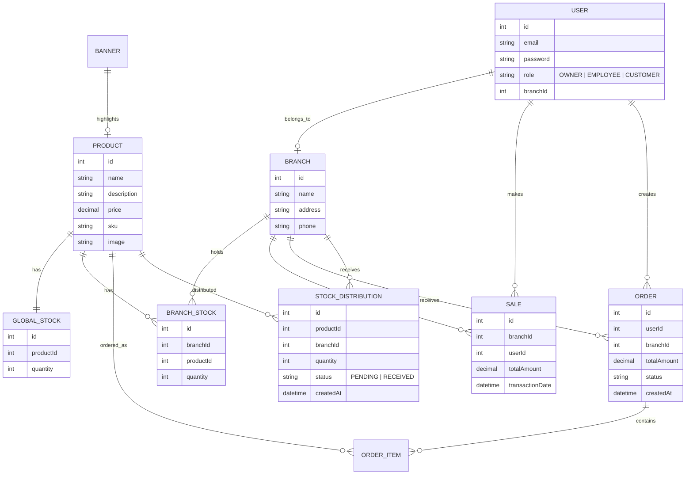

# Database Schema - Supernova

## Entity Relationship Diagram (ERD)

## Description
- **USER**: Centralized table for all roles. Employees are tied to a specific `branchId`.
- **PRODUCT**: Master catalog of all perfume products.
- **GLOBAL_STOCK**: Single record per product representing warehouse inventory.
- **BRANCH_STOCK**: Inventory per product per branch.
- **STOCK_DISTRIBUTION**: Tracks movement of goods between Global and Branch.
- **ORDER/SALE**: Records of customer buying and point-of-sale transactions.
