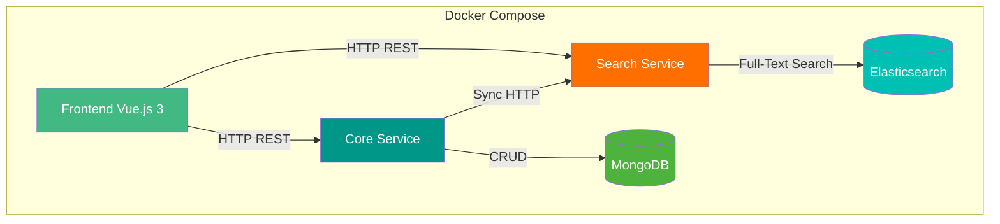
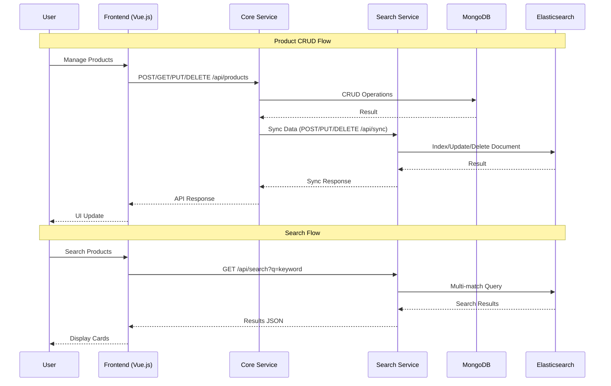

# 🚀 Mongo Search Portal

> Aplikasi demonstrasi perbandingan pencarian data antara **MongoDB** (regex) dan **Elasticsearch** (full-text search) dengan studi kasus Toko Peralatan Komputer. Dibangun menggunakan arsitektur **microservice** dengan **FastAPI** sebagai backend dan **Vue.js 3** sebagai frontend.

## ✨ Features

- **📦 Product CRUD** — Kelola data produk (Create, Read, Update, Delete) via REST API
- **🔍 Full-Text Search** — Pencarian produk menggunakan Elasticsearch multi_match query
- **🔎 Regex Search** — Pencarian produk menggunakan MongoDB regex pattern matching
- **📊 Perbandingan** — Membandingkan hasil dan performa pencarian antara MongoDB dan Elasticsearch
- **🌐 REST API** — Backend microservice dengan dokumentasi Swagger otomatis
- **🐳 Docker Support** — Seluruh aplikasi siap dijalankan dengan Docker Compose
- **🎨 Frontend Modern** — UI responsive dengan Vue.js 3 dan Bootstrap 5

## 🏗️ Architecture



### Alur Data



## 📁 Folder Structure

```
project-root/
├── frontend/                     # Vue.js 3 Frontend
│   ├── Dockerfile
│   ├── package.json
│   ├── vite.config.js
│   ├── index.html
│   └── src/
│       ├── main.js               # Entry point
│       ├── App.vue                # Layout utama
│       ├── router/index.js        # Vue Router
│       ├── services/api.js        # Axios API client
│       ├── components/            # Reusable components
│       │   ├── Navbar.vue
│       │   ├── Footer.vue
│       │   ├── Loading.vue
│       │   ├── ProductTable.vue
│       │   ├── ProductModal.vue
│       │   ├── SearchBar.vue
│       │   └── SearchCard.vue
│       └── pages/                 # Halaman aplikasi
│           ├── Home.vue
│           ├── Products.vue
│           └── Search.vue
│
├── core-service/                 # Core Service (FastAPI + MongoDB)
│   ├── Dockerfile
│   ├── requirements.txt
│   └── app/
│       ├── main.py               # FastAPI entry point
│       ├── config.py             # Environment config
│       ├── routes.py             # REST API endpoints
│       ├── schemas.py            # Pydantic models
│       └── mongo_service.py      # MongoDB CRUD operations
│
├── search-service/               # Search Service (FastAPI + Elasticsearch)
│   ├── Dockerfile
│   ├── requirements.txt
│   └── app/
│       ├── main.py               # FastAPI entry point
│       ├── config.py             # Environment config
│       ├── routes.py             # REST API endpoints
│       ├── schemas.py            # Pydantic models
│       └── elastic_service.py    # Elasticsearch operations
│
├── data/                         # Dataset
│   └── products.json             # 12 produk toko komputer
│
├── docs/
│   ├── ANALISIS_DAN_RENCANA_REFACTOR.md
│   └── skpl/                     # Spesifikasi Kebutuhan Perangkat Lunak
│       ├── 01-pendahuluan.md
│       ├── 02-deskripsi-umum.md
│       ├── 03-kebutuhan-fungsional.md
│       ├── 04-kebutuhan-non-fungsional.md
│       ├── 05-kebutuhan-antarmuka.md
│       ├── 06-model-data.md
│       └── 07-arsitektur-sistem.md
│
├── docker-compose.yml            # Docker orchestrator
├── .env.example                  # Environment variables template
└── README.md                     # Dokumentasi ini
```

## 🛠️ Tech Stack

| Layer | Technology |
|-------|-----------|
| **Frontend** | Vue.js 3, Vite, Vue Router, Axios, Bootstrap 5, Bootstrap Icons |
| **Backend (Core)** | Python 3.12, FastAPI, Uvicorn, PyMongo, Pydantic |
| **Backend (Search)** | Python 3.12, FastAPI, Uvicorn, Elasticsearch DSL, Pydantic |
| **Database** | MongoDB 7, Elasticsearch 8.15 |
| **DevOps** | Docker, Docker Compose |
| **Documentation** | OpenAPI / Swagger (auto-generated) |

## 📋 REST API

### Core Service (Port 8001)

| Method | Endpoint | Description |
|--------|----------|-------------|
| `GET` | `/` | Health check |
| `GET` | `/api/products` | Get all products |
| `GET` | `/api/products/{id}` | Get product by ID |
| `POST` | `/api/products` | Create new product |
| `PUT` | `/api/products/{id}` | Update product |
| `DELETE` | `/api/products/{id}` | Delete product |
| `POST` | `/api/products/seed` | Seed dataset from products.json |

**Base URL:** `http://localhost:8001`  
**Swagger UI:** `http://localhost:8001/docs`

### Search Service (Port 8002)

| Method | Endpoint | Description |
|--------|----------|-------------|
| `GET` | `/` | Health check |
| `GET` | `/api/search?q=` | Full-text search products |
| `POST` | `/api/sync` | Bulk sync products (from Core Service) |
| `PUT` | `/api/sync/{id}` | Update single document |
| `DELETE` | `/api/sync/{id}` | Delete single document |
| `GET` | `/api/stats` | Get Elasticsearch index stats |

**Base URL:** `http://localhost:8002`  
**Swagger UI:** `http://localhost:8002/docs`

### Response Format

**Success:**
```json
{
  "status": "success",
  "message": "Ditemukan 12 produk",
  "data": [...],
  "total": 12
}
```

**Error:**
```json
{
  "status": "error",
  "message": "Product not found",
  "error_code": "NOT_FOUND"
}
```

## 🐳 Docker Deployment

### Prerequisites

- Docker Engine 24+
- Docker Compose v2+
- Minimum 4GB RAM (recommended: 8GB)

### Quick Start

```bash
# 1. Clone repository
git clone https://github.com/fathiyyah28/topik_khusus.git
cd topik_khusus

# 2. Copy environment file
cp .env.example .env

# 3. Start all services
docker compose up -d

# 4. Access the application
open http://localhost:3000

# 5. Seed initial data
curl -X POST http://localhost:8001/api/products/seed

# 6. Stop all services
docker compose down

# 7. Remove volumes (destroy data)
docker compose down -v
```

### Services & Ports

| Service | Container Name | Port (Host) | Port (Container) |
|---------|---------------|-------------|------------------|
| Frontend | `frontend` | 3000 | 3000 |
| Core Service | `core-service` | 8001 | 8001 |
| Search Service | `search-service` | 8002 | 8002 |
| MongoDB | `mongodb` | 27017 | 27017 |
| Elasticsearch | `elasticsearch` | 9200 | 9200 |

### View Logs

```bash
# All services
docker compose logs -f

# Specific service
docker compose logs -f core-service
docker compose logs -f search-service
docker compose logs -f frontend
docker compose logs -f mongodb
docker compose logs -f elasticsearch
```

## 💻 Installation (Development)

### Prerequisites

- Python 3.12+
- Node.js 20+
- MongoDB 7 (running on localhost:27017)
- Elasticsearch 8.15 (running on localhost:9200)

### Backend Setup

```bash
# Core Service
cd core-service
pip install -r requirements.txt
python -m app.main
# Running on http://localhost:8001

# Search Service (in new terminal)
cd search-service
pip install -r requirements.txt
python -m app.main
# Running on http://localhost:8002
```

### Frontend Setup

```bash
cd frontend
npm install
npm run dev
# Running on http://localhost:3000
```

### Seed Data

```bash
curl -X POST http://localhost:8001/api/products/seed
```

## 🌍 Environment Variables

| Variable | Default | Description |
|----------|---------|-------------|
| `CORE_SERVICE_PORT` | `8001` | Core Service port |
| `SEARCH_SERVICE_PORT` | `8002` | Search Service port |
| `FRONTEND_PORT` | `3000` | Frontend port |
| `MONGO_HOST` | `mongodb` | MongoDB hostname |
| `MONGO_PORT` | `27017` | MongoDB port |
| `MONGO_DB_NAME` | `toko_komputer` | MongoDB database name |
| `MONGO_COLLECTION_NAME` | `produk` | MongoDB collection name |
| `ELASTIC_HOST` | `elasticsearch` | Elasticsearch hostname |
| `ELASTIC_PORT` | `9200` | Elasticsearch port |
| `ELASTIC_INDEX_NAME` | `produk` | Elasticsearch index name |
| `SEARCH_SERVICE_URL` | `http://search-service:8002` | Search Service URL (internal) |
| `DATASET_PATH` | `/app/data/products.json` | Path to dataset file |
| `VITE_CORE_SERVICE_URL` | `http://localhost:8001/api` | Core Service URL (frontend) |
| `VITE_SEARCH_SERVICE_URL` | `http://localhost:8002/api` | Search Service URL (frontend) |

## 📸 Screenshots

*[Screenshots akan ditambahkan setelah aplikasi berjalan]*

| Page | Description |
|------|-------------|
| Home | Dashboard with system status and statistics |
| Products | CRUD table with add/edit/delete modals |
| Search | Full-text search with card results |

## 🔮 Future Improvements

- [ ] **Compare Page** — Side-by-side comparison of MongoDB vs Elasticsearch results
- [ ] **Pagination** — Pagination for product list and search results
- [ ] **Authentication** — Simple user authentication for product management
- [ ] **Export Data** — Export product data to CSV/Excel
- [ ] **Advanced Search** — Filter by category, price range, stock status
- [ ] **Unit Tests** — Comprehensive test coverage for all services

## 📄 License

This project is developed for educational purposes as part of **Topik Khusus** course.

---

<div align="center">
  <p>Topik Khusus — MongoDB + Elasticsearch</p>
  <p>Universitas <i>[Nama Universitas]</i></p>
</div>