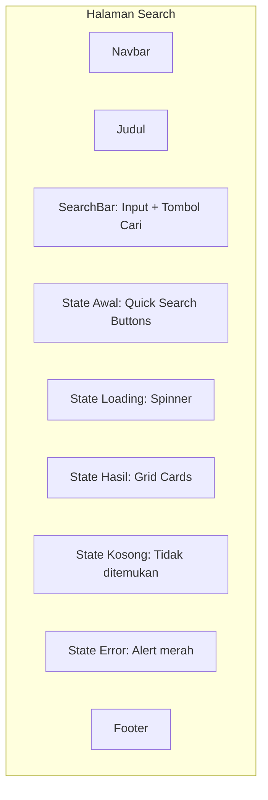

# BAB 5: KEBUTUHAN ANTARMUKA

## 5.1 Antarmuka Pengguna (Frontend)

### 5.1.1 Halaman Home

```mermaid
graph TD
    subgraph "Halaman Home"
        A[Navbar: Mongo Search Portal - Home | Products | Search]
        B[Hero Section: Judul + Deskripsi]
        C[Card Arsitektur: Vue.js → Core Service → Search Service]
        D[Stat Cards: Total Produk | MongoDB | Elasticsearch | Search Service]
        E[Footer: Topik Khusus - MongoDB + Elasticsearch]
    end
```

**Komponen:**
1. **Navbar**: Brand "Mongo Search Portal" di kiri, menu Home/Products/Search di kanan
2. **Hero Section**: Icon search-heart besar, judul "Mongo Search Portal", deskripsi singkat
3. **Arsitektur Card**: Diagram alur Frontend → Core Service → Search Service
4. **Stat Cards**: 4 card dengan icon Bootstrap:
   - Total Produk (icon box-seam, warna primary)
   - MongoDB (icon database, hijau/merah)
   - Elasticsearch (icon search, hijau/merah)
   - Search Service (icon server, hijau/merah)
5. **Footer**: Teks "Topik Khusus | MongoDB + Elasticsearch"

### 5.1.2 Halaman Products

```mermaid
graph TD
    subgraph "Halaman Products"
        A[Navbar]
        B[Judul + Tombol Seed Data + Tombol Tambah]
        C[Table Produk: ID | Nama | Kategori | Harga | Stok | Spesifikasi | Aksi]
        D[Modal Tambah/Edit Produk]
        E[Modal Konfirmasi Hapus]
        F[Toast Notification]
        G[Footer]
    end
```

**Komponen:**
1. **Header**: Judul "Daftar Produk" + tombol "Seed Data" (success) + tombol "Tambah Produk" (primary)
2. **ProductTable**: Tabel dengan kolom:
   - ID (text-center, bold)
   - Nama
   - Kategori (badge info)
   - Harga (text-end, warna success, format Rupiah)
   - Stok (badge: hijau > 10, kuning 1-10, merah 0)
   - Spesifikasi (text-truncate)
   - Aksi (tombol edit outline-primary, tombol delete outline-danger)
3. **ProductModal**: Modal untuk tambah/edit dengan form:
   - ID (number, disabled saat edit)
   - Nama (text)
   - Kategori (select dropdown)
   - Harga (number)
   - Stok (number)
   - Spesifikasi (textarea)
4. **Delete Modal**: Konfirmasi hapus dengan nama produk
5. **Toast**: Notifikasi sukses/gagal di pojok kanan bawah

### 5.1.3 Halaman Search



**Komponen:**
1. **SearchBar**: Input group dengan icon search, input text, tombol clear (X), tombol "Cari"
2. **Initial State**: Icon panah, teks "Mulai Pencarian", 5 quick search button (laptop, keyboard, mouse, monitor, ssd)
3. **Loading State**: Spinner Bootstrap dengan teks "Mencari data..."
4. **Results State**: Grid 3 kolom card produk
5. **Empty State**: Icon emoji sedih, teks "Tidak ditemukan"
6. **Error State**: Alert merah dengan pesan error

## 5.2 Antarmuka API (REST)

### 5.2.1 Format Request

Semua request menggunakan format JSON dengan Content-Type: `application/json`.

### 5.2.2 Format Response Sukses

```json
{
  "status": "success",
  "message": "Ditemukan 12 produk",
  "data": [],
  "total": 12
}
```

### 5.2.3 Format Response Error

```json
{
  "status": "error",
  "message": "Produk dengan ID 99 tidak ditemukan",
  "error_code": "NOT_FOUND"
}
```

### 5.2.4 HTTP Status Codes

| Kode | Deskripsi |
|------|-----------|
| 200 | Request berhasil |
| 201 | Resource berhasil dibuat |
| 400 | Request tidak valid (bad request) |
| 404 | Resource tidak ditemukan |
| 500 | Internal server error |
| 503 | Service tidak tersedia (database/server) |

## 5.3 Antarmuka Swagger / OpenAPI

Setiap service backend menyediakan dokumentasi API otomatis:

| Service | URL |
|---------|-----|
| Core Service | `http://localhost:8001/docs` |
| Search Service | `http://localhost:8002/docs` |

Dokumentasi mencakup:
- Daftar endpoint lengkap
- Parameter request
- Schema request/response
- Contoh kode
- Try-it-out untuk pengujian langsung

## 5.4 Antarmuka Docker

Antarmuka deployment melalui Docker Compose:

```bash
# Start semua service
docker compose up -d

# Melihat log
docker compose logs -f

# Stop semua service
docker compose down
```

## 5.5 Warna dan Tema

| Elemen | Warna | Kode Bootstrap |
|--------|-------|----------------|
| Navbar | Biru (primary) | `bg-primary` |
| Tombol Utama | Biru (primary) | `btn-primary` |
| Tombol Seed | Hijau (success) | `btn-success` |
| Tombol Hapus | Merah (danger) | `btn-danger` |
| Badge Kategori | Cyan (info) | `badge bg-info` |
| Badge Stok Aman | Hijau (success) | `badge bg-success` |
| Badge Stok Rendah | Kuning (warning) | `badge bg-warning` |
| Badge Stok Habis | Merah (danger) | `badge bg-danger` |
| Background | Abu-abu terang | `bg-light` / `#f8f9fa` |
| Tabel Header | Biru (primary) | `table-primary` |

## 5.6 Tipografi

| Elemen | Font |
|--------|------|
| Body | System font stack (Bootstrap default) |
| Heading | Bold, system font stack |
| Harga | `fw-semibold text-success` |
| Kode/Path | Monospace (jika ada) |