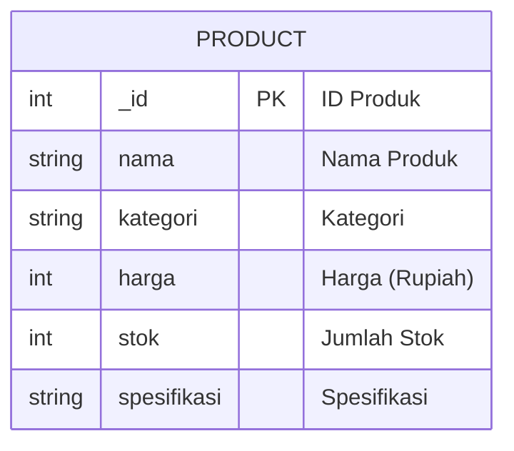
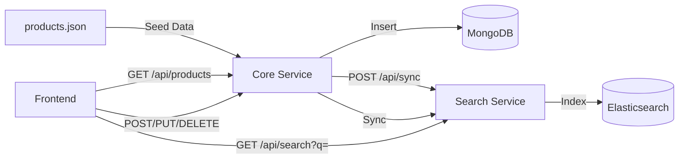

# BAB 6: MODEL DATA

## 6.1 Entity Relationship Diagram (ERD)



**Catatan:** Sistem hanya memiliki satu entitas yaitu `Product` karena aplikasi ini adalah demonstrasi pencarian data sederhana tanpa relasi kompleks.

## 6.2 Struktur Data Produk

### 6.2.1 Format JSON (Dataset)

File `data/products.json` berisi 12 produk toko peralatan komputer:

```json
{
  "_id": 1,
  "nama": "Laptop Asus ROG Zephyrus G14",
  "kategori": "Laptop",
  "harga": 18999000,
  "stok": 15,
  "spesifikasi": "AMD Ryzen 9, RAM 16GB, SSD 512GB, RTX 3060"
}
```

### 6.2.2 Deskripsi Field

| Field | Tipe Data | Panjang | Keterangan | Contoh |
|-------|-----------|---------|------------|--------|
| `_id` | Integer | - | Primary key, unique identifier produk | 1 |
| `nama` | String | 100 | Nama lengkap produk | Laptop Asus ROG Zephyrus G14 |
| `kategori` | String | 50 | Kategori produk | Laptop |
| `harga` | Integer | - | Harga dalam Rupiah, >= 0 | 18999000 |
| `stok` | Integer | - | Jumlah stok, >= 0 | 15 |
| `spesifikasi` | String | 255 | Deskripsi spesifikasi teknis | AMD Ryzen 9, RAM 16GB... |

### 6.2.3 Daftar Kategori

| No | Kategori |
|----|----------|
| 1 | Laptop |
| 2 | Mouse |
| 3 | Keyboard |
| 4 | Monitor |
| 5 | Flashdisk |
| 6 | SSD |
| 7 | RAM |
| 8 | Printer |
| 9 | Webcam |
| 10 | Speaker |
| 11 | Harddisk |
| 12 | Router |

## 6.3 Model Data di MongoDB

### 6.3.1 Database

- **Nama Database**: `toko_komputer`
- **Collection**: `produk`

### 6.3.2 Document MongoDB

```json
{
  "_id": 1,
  "nama": "Laptop Asus ROG Zephyrus G14",
  "kategori": "Laptop",
  "harga": 18999000,
  "stok": 15,
  "spesifikasi": "AMD Ryzen 9, RAM 16GB, SSD 512GB, RTX 3060"
}
```

### 6.3.3 Index

MongoDB menggunakan pencarian regex tanpa index khusus. Pencarian dilakukan pada field `nama`, `kategori`, dan `spesifikasi` menggunakan `$regex` dengan pattern case-insensitive.

## 6.4 Model Data di Elasticsearch

### 6.4.1 Index

- **Nama Index**: `produk`

### 6.4.2 Mapping

```json
{
  "mappings": {
    "properties": {
      "_id": { "type": "integer" },
      "nama": { "type": "text", "analyzer": "standard" },
      "kategori": { "type": "text", "analyzer": "standard" },
      "harga": { "type": "integer" },
      "stok": { "type": "integer" },
      "spesifikasi": { "type": "text", "analyzer": "standard" }
    }
  }
}
```

### 6.4.3 Tipe Data Elasticsearch

| Field | Tipe ES | Keterangan |
|-------|---------|------------|
| `_id` | integer | ID numerik produk |
| `nama` | text | Full-text search dengan analyzer standard |
| `kategori` | text | Full-text search dengan analyzer standard |
| `harga` | integer | Harga dalam angka |
| `stok` | integer | Stok dalam angka |
| `spesifikasi` | text | Full-text search dengan analyzer standard |

## 6.5 Pydantic Schema (Backend)

### 6.5.1 Core Service Schema

```python
class ProductCreateSchema(BaseModel):
    _id: int
    nama: str
    kategori: str
    harga: int  # >= 0
    stok: int   # >= 0
    spesifikasi: str

class ProductUpdateSchema(BaseModel):
    nama: Optional[str]
    kategori: Optional[str]
    harga: Optional[int]  # >= 0
    stok: Optional[int]   # >= 0
    spesifikasi: Optional[str]
```

### 6.5.2 Search Service Schema

```python
class SyncRequest(BaseModel):
    products: Optional[List[Dict[str, Any]]]

class SearchResponse(BaseModel):
    status: str = "success"
    data: List[dict] = []
    total: int = 0
    keyword: str = ""
```

## 6.6 Data Flow Diagram



## 6.7 Validasi Data

| Field | Aturan Validasi |
|-------|-----------------|
| `_id` | Wajib diisi, harus integer, unique |
| `nama` | Wajib diisi, string tidak kosong |
| `kategori` | Wajib diisi, harus salah satu dari 12 kategori yang tersedia |
| `harga` | Wajib diisi, integer, >= 0 |
| `stok` | Wajib diisi, integer, >= 0 |
| `spesifikasi` | Wajib diisi, string tidak kosong |