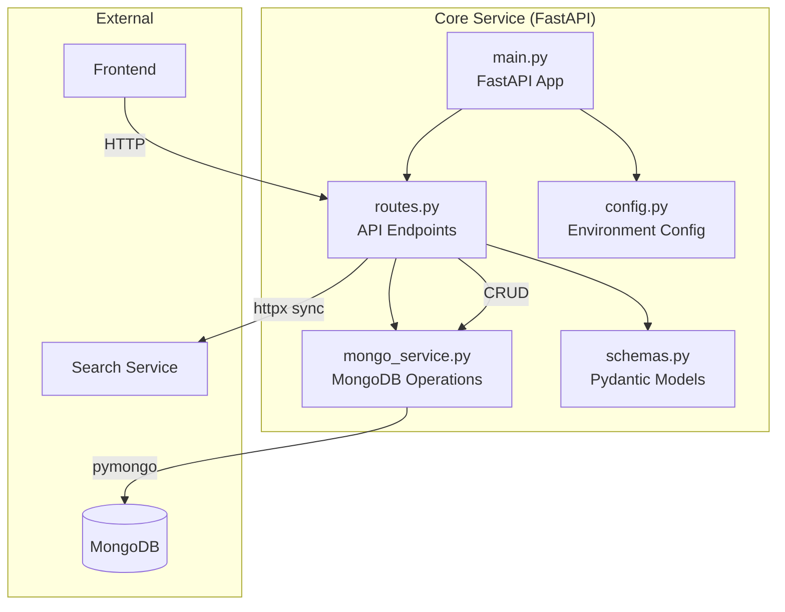
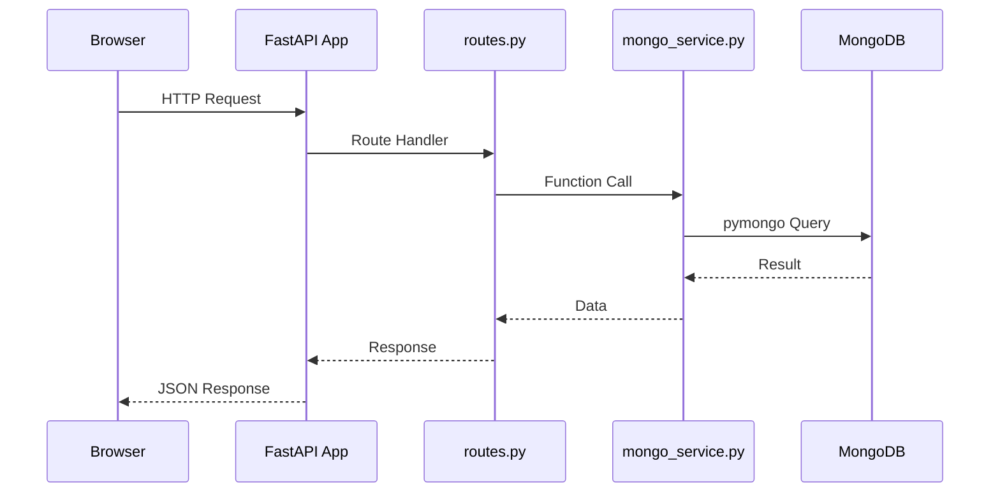
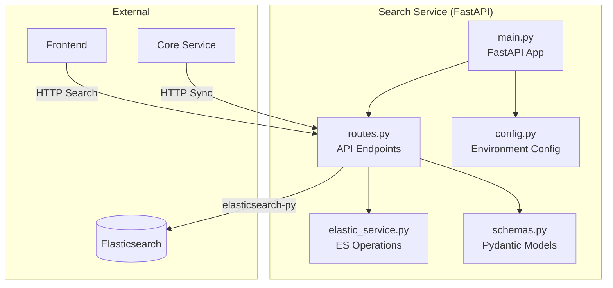
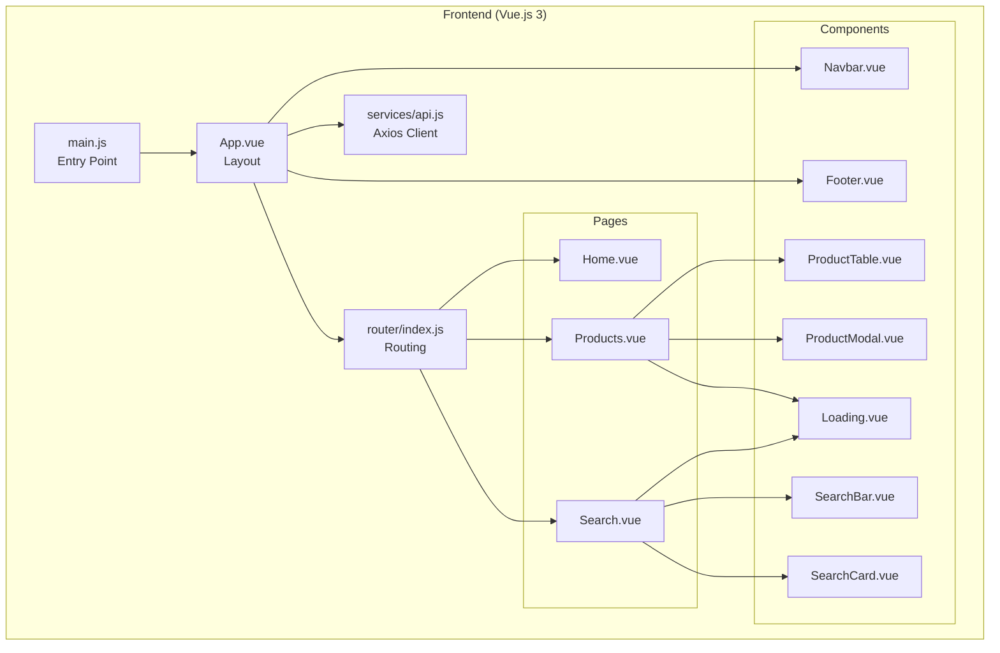
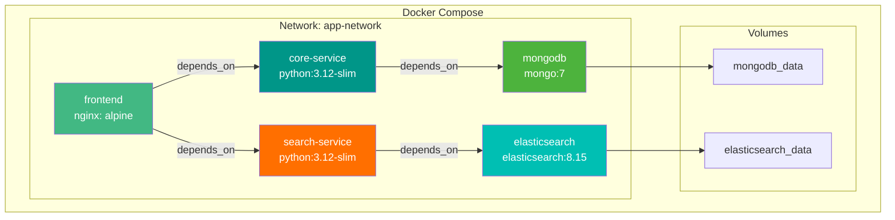
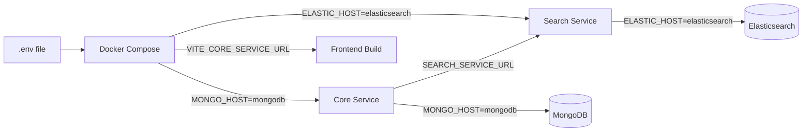
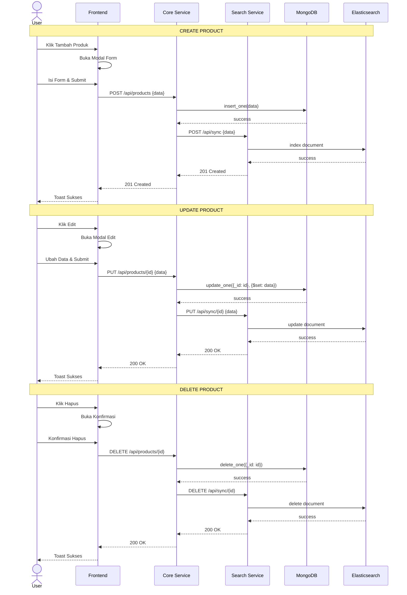
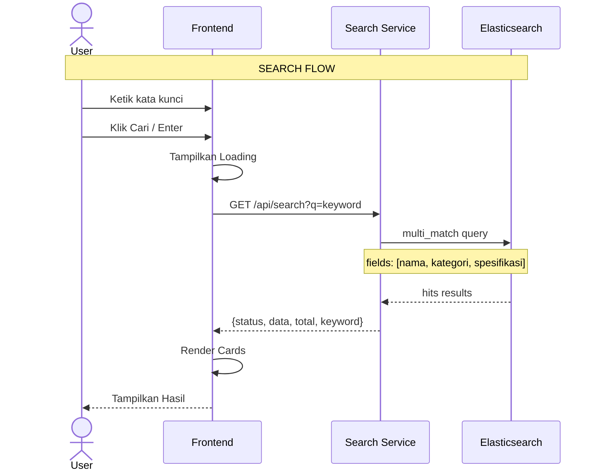

# BAB 7: ARSITEKTUR SISTEM

## 7.1 Arsitektur Umum

Sistem Mongo Search Portal menggunakan arsitektur **microservice** dengan tiga komponen utama yang berjalan dalam container Docker.

```mermaid
graph TB
    subgraph "Client"
        A[Browser]
    end

    subgraph "Docker Compose Network"
        subgraph "Frontend Layer"
            B[Vue.js 3 App<br/>Port 3000]
        end

        subgraph "Backend Layer"
            C[Core Service<br/>FastAPI | Port 8001]
            D[Search Service<br/>FastAPI | Port 8002]
        end

        subgraph "Database Layer"
            E[(MongoDB 7<br/>Port 27017)]
            F[(Elasticsearch 8.15<br/>Port 9200)]
        end

        subgraph "Volume Storage"
            G[mongodb_data<br/>Volume]
            H[elasticsearch_data<br/>Volume]
        end
    end

    A -->|HTTP| B
    B -->|REST API| C
    B -->|REST API| D
    C -->|CRUD| E
    C -->|HTTP Sync| D
    D -->|Full-Text Search| F
    E --> G
    F --> H

    style A fill:#e1f5fe
    style B fill:#42b883,color:#fff
    style C fill:#009688,color:#fff
    style D fill:#ff6f00,color:#fff
    style E fill:#4db33d,color:#fff
    style F fill:#00bfb3,color:#fff
```

## 7.2 Arsitektur Microservice

### 7.2.1 Pembagian Service

| Service | Bahasa | Framework | Database | Port |
|---------|--------|-----------|----------|------|
| Frontend | JavaScript | Vue.js 3 + Vite | - | 3000 |
| Core Service | Python | FastAPI | MongoDB | 8001 |
| Search Service | Python | FastAPI | Elasticsearch | 8002 |

### 7.2.2 Karakteristik Microservice

| Karakteristik | Implementasi |
|---------------|--------------|
| **Deployment Independence** | Setiap service memiliki Dockerfile sendiri |
| **Database Independence** | Core Service menggunakan MongoDB, Search Service menggunakan Elasticsearch |
| **Communication** | Frontend → Backend via HTTP REST, Core → Search via HTTP |
| **Technology Diversity** | Vue.js (frontend), Python/FastAPI (backend) |
| **Scalability** | Setiap service dapat di-scale secara independen |

## 7.3 Arsitektur Core Service



### 7.2.2 Alur Request



## 7.4 Arsitektur Search Service



## 7.5 Arsitektur Frontend



## 7.6 Arsitektur Deployment (Docker)



### 7.6.1 Port Mapping

| Container | Internal Port | Host Port | Protocol |
|-----------|---------------|-----------|----------|
| frontend | 3000 | 3000 | TCP |
| core-service | 8001 | 8001 | TCP |
| search-service | 8002 | 8002 | TCP |
| mongodb | 27017 | 27017 | TCP |
| elasticsearch | 9200 | 9200 | TCP |

### 7.6.2 Volume Mapping

| Volume | Container Path | Deskripsi |
|--------|---------------|-----------|
| mongodb_data | /data/db | Data persistence MongoDB |
| elasticsearch_data | /usr/share/elasticsearch/data | Data persistence Elasticsearch |

### 7.6.3 Environment Variable Flow



## 7.7 Komunikasi Antar Service

### 7.7.1 Frontend → Core Service

- **Protokol**: HTTP REST
- **Format**: JSON
- **Endpoint**: `http://core-service:8001/api/*`
- **Fungsi**: CRUD produk

### 7.7.2 Frontend → Search Service

- **Protokol**: HTTP REST
- **Format**: JSON
- **Endpoint**: `http://search-service:8002/api/*`
- **Fungsi**: Pencarian full-text

### 7.7.3 Core Service → Search Service (Sync)

- **Protokol**: HTTP REST (httpx async)
- **Format**: JSON
- **Endpoint**: `/api/sync`, `/api/sync/{id}`
- **Trigger**: Operasi create, update, delete data
- **Fault Tolerance**: Jika Search Service offline, CRUD tetap berjalan (sync gagal dilewati)

## 7.8 Sequence Diagram: CRUD Product



## 7.9 Sequence Diagram: Search Product



## 7.10 Stack Teknologi

```mermaid
graph LR
    subgraph "Frontend"
        A1[Vue.js 3]
        A2[Vite]
        A3[Bootstrap 5]
        A4[Axios]
        A5[Vue Router]
    end

    subgraph "Backend Core"
        B1[Python 3.12]
        B2[FastAPI]
        B3[Uvicorn]
        B4[PyMongo]
        B5[Pydantic]
        B6[httpx]
    end

    subgraph "Backend Search"
        C1[Python 3.12]
        C2[FastAPI]
        C3[Uvicorn]
        C4[elasticsearch-py]
        C5[Pydantic]
    end

    subgraph "Database"
        D1[MongoDB 7]
        D2[Elasticsearch 8.15]
    end

    subgraph "DevOps"
        E1[Docker]
        E2[Docker Compose]
    end

    A1 --> A2
    A1 --> A3
    A1 --> A4
    A1 --> A5
    
    B2 --> B3
    B2 --> B4
    B2 --> B5
    B2 --> B6
    
    C2 --> C3
    C2 --> C4
    C2 --> C5
    
    B4 --> D1
    C4 --> D2
    
    E1 --> E2
    E2 --> B2
    E2 --> C2
    E2 --> A1
    E2 --> D1
    E2 --> D2